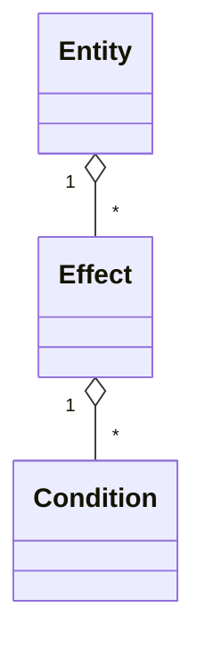

**原則**: 「対象(Entity) - 条件(Condition) - 行動(Effect/Action)」の3段階構造は、独自の名前を付けずに **ECA (Event-Condition-Action) パターン** と呼ぶ。Event = 何らかの操作が呼ばれること、Condition = 発動条件(Specificationパターンとして合成可能な真偽判定)、Action = 実際の効果適用(Strategyパターンとして差し替え可能な振る舞い)。Entityは複数のEffectを持ち(1..*)、各Effectは複数のCondition(発動条件)を持つ(1..*)。

**なぜ**: 独自名(「ギミックパターン」など)を付けてしまうと、初見の実装者(人間・AI問わず)はゼロから設計を理解しようとして時間を浪費したり、既存のECA/Specification/Strategyパターンの知識を転用できずに車輪の再発明をしてしまう。実体が既知のパターンの合成だと認識できれば、「Conditionを増やすときは新しいIConditionを実装するだけでよい」「Entityにif文を増やす必要はない」という判断が即座につく。

**どう適用するか**: 「対象 - 条件 - 行動」のような3段階構造に出会ったら、ECAパターンとして名付ける。Condition部分はSpecificationパターン(合成可能な真偽判定オブジェクト)、Action/Effect部分はStrategyパターン(差し替え可能な振る舞い)としてそれぞれ独立interfaceにし、Entityは「どのEffect/Conditionを持つか」のリストを保持するだけにする設計を検討する。
